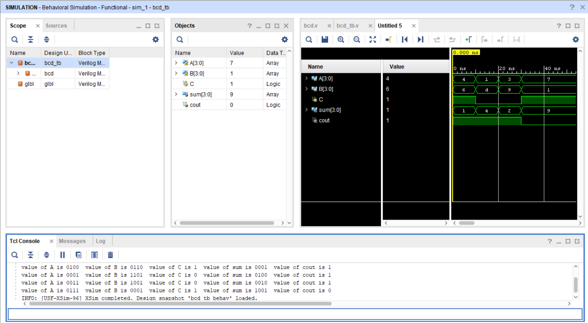

BCD_Adder

About:
This project implements a BCD Adder in Verilog. The design adds two BCD digits and performs the necessary correction whenever the sum exceeds 9.

Files:
- [Design File](design/top.v)
- [Testbench File](tb/tb_top.v)

Simulation Output:

The waveform confirms the correct operation of the BCD adder for the applied test cases.
