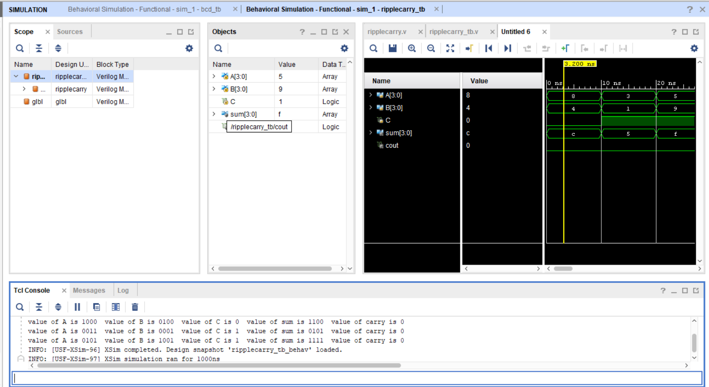

Ripple Carry Adder

About:
This project implements a 4-bit Ripple Carry Adder in Verilog. The adder is constructed by connecting multiple full adders in series, where the carry output of one stage becomes the carry input of the next stage.

Files
* [Design File](design/top.v)
* [Testbench File](tb/tb_top.v)

Simulation Output

The waveform shows the correct generation of the sum and carry outputs for different input combinations.

Notes:
The design was verified using the testbench, and the simulation results matched the expected behavior of a 4-bit Ripple Carry Adder.

