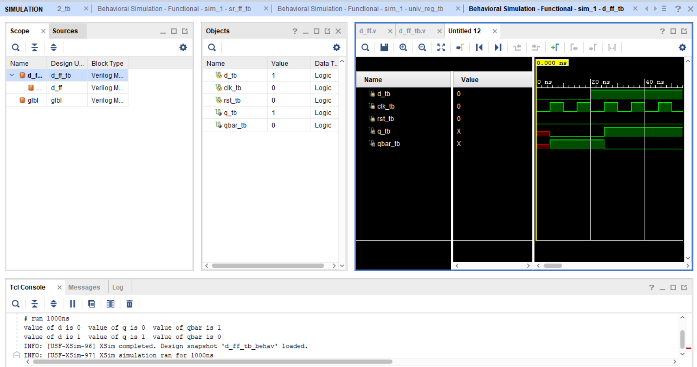

D Flip-Flop

About:
This project implements a D Flip-Flop in Verilog. The flip-flop stores the value present at the D input and transfers it to the output on the active edge of the clock.

Files:
[Design File](design/top.v)
[Testbench File](tb/tb_top.v)

Simulation Output:

The waveform shows that the output follows the input only on the active clock edge, demonstrating the correct operation of the D Flip-Flop.

Notes:
The design was verified using the testbench, and the simulation results matched the expected behavior of a D Flip-Flop.
