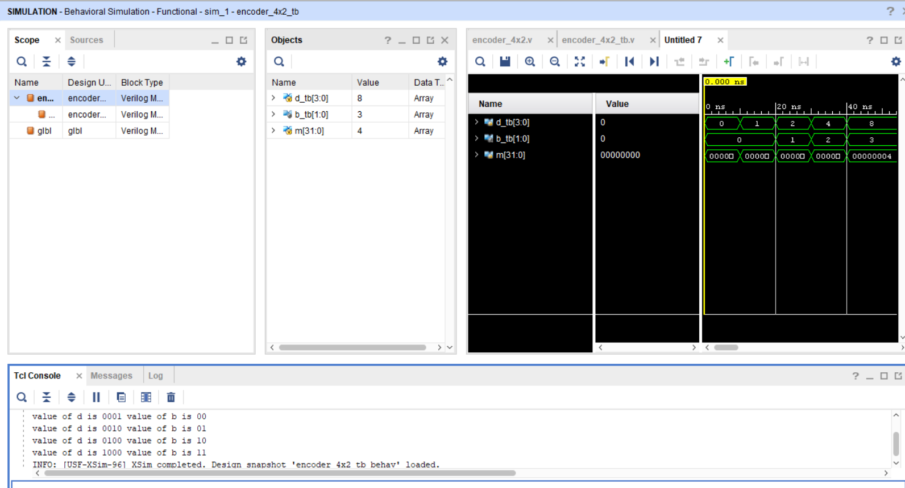

4x2 Encoder

About:
This project implements a 4x2 Encoder in Verilog. The encoder converts one of four active input lines into a 2-bit binary output corresponding to the active input.

Files:
* [Design File](design/top.v)
* [Testbench File](tb/tb_top.v)

Simulation Output

The waveform shows the correct binary output for each active input, verifying the operation of the 4x2 Encoder.

Notes:
The design was verified using the testbench, and the simulation results matched the expected behavior of a 4x2 Encoder.
