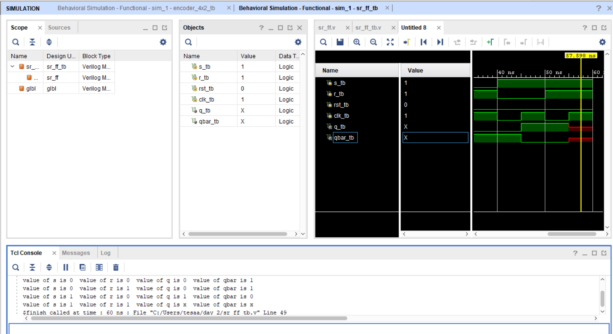

SR Flip-Flop

About:
This project implements an SR (Set-Reset) Flip-Flop in Verilog. The flip-flop changes its state based on the Set (S) and Reset (R) inputs and stores the output until the next valid input condition.

Files:
* [Design File](design/top.v)
* [Testbench File](tb/tb_top.v)

Simulation Output:

The waveform demonstrates the set, reset, and hold operations of the SR Flip-Flop, verifying its correct functionality.

Notes:
The design was verified using the testbench, and the simulation results matched the expected behavior of an SR Flip-Flop.
