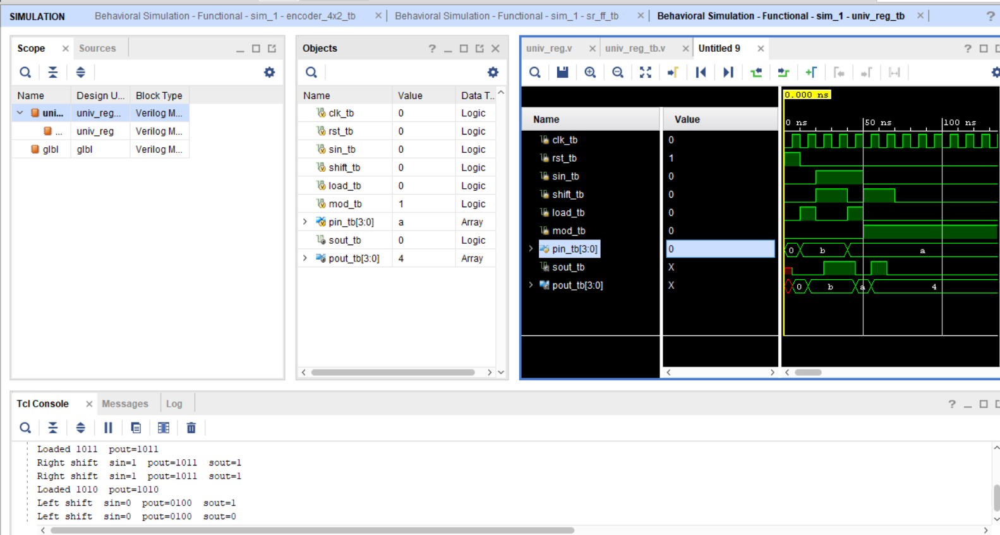

Universal Shift Register

About:
This project implements a Universal Shift Register in Verilog. The register supports multiple operations such as holding data, shifting left, shifting right, and parallel loading based on the control inputs.

Files:
* [Design File](design/top.v)
* [Testbench File](tb/tb_top.v)

Simulation Output

The waveform demonstrates the different modes of operation of the Universal Shift Register, including hold, shift left, shift right, and parallel load.

Notes:
The design was verified using the testbench, and the simulation results matched the expected behavior of a Universal Shift Register.
