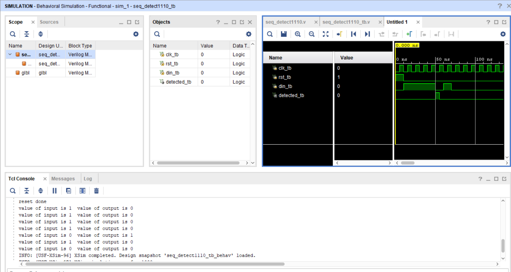

Sequence Detector (1110)

About:
This project implements a sequence detector using a Finite State Machine (FSM) in Verilog. The detector monitors a serial input stream and generates an output whenever the sequence `1110` is detected.

Files:
[Design File](design/top.v)  
[Testbench File](tb/tb_top.v)

Simulation Output:

The waveform shows the serial input being monitored continuously. Whenever the sequence `1110` appears in the input stream, the detector asserts the output, indicating successful sequence detection.

Notes:
The design was implemented using an FSM with multiple states representing the progress of sequence matching. The functionality was verified using a testbench, and the simulation results matched the expected sequence detection behavior.
