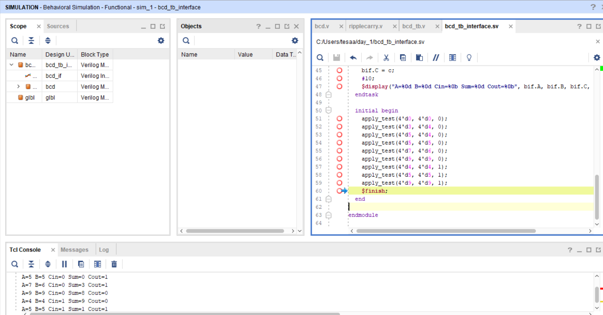

## BCD Adder with Interface Testbench

About:
This project implements a BCD Adder in Verilog. The adder takes two 4-bit BCD digits and a carry input, producing a valid BCD sum and carry output using ripple carry adders and correction logic.

Files:
* [Design File](design/top.v)
* [Testbench File](tb/tb_top.sv)

Simulation Output

The waveform shows correct BCD sum and carry output for various input combinations including cases requiring correction logic, verifying the operation of the BCD Adder.

Notes:
The design was verified using a SystemVerilog interface-based testbench, and the simulation results matched the expected behavior of a BCD Adder.
