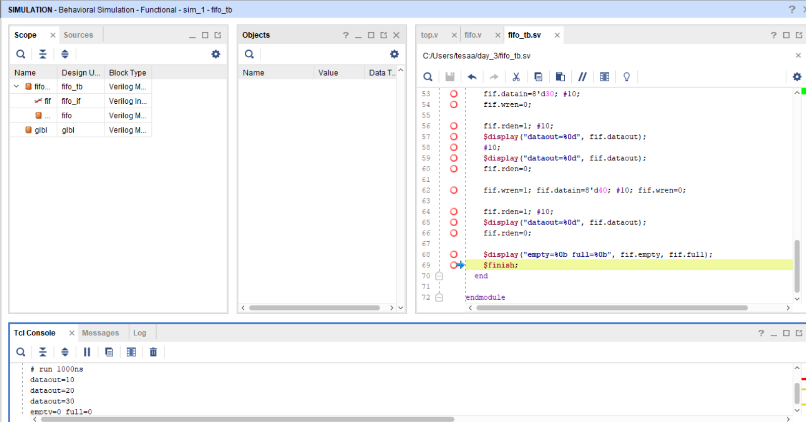

## FIFO with Interface Testbench

About:
This project implements an 8-depth FIFO in Verilog. The FIFO stores and retrieves 8-bit data in first-in first-out order, with full and empty flag generation.

Files:
* [Design File](design/top.v)
* [Testbench File](tb/tb_top.sv)

Simulation Output

The waveform shows correct read and write operations along with proper assertion of full and empty flags, verifying the operation of the FIFO.

Notes:
The design was verified using a SystemVerilog interface-based testbench, and the simulation results matched the expected behavior of a FIFO.
