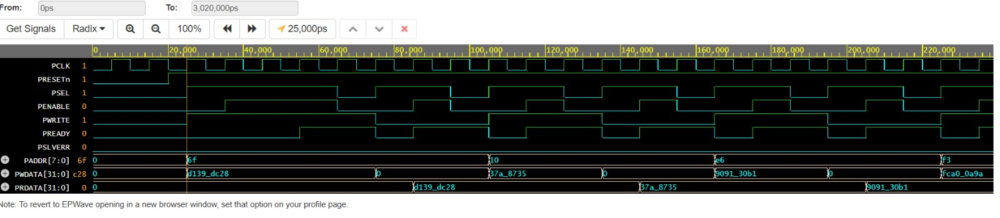

# APB Slave Memory

## Overview

This project implements a simple APB (Advanced Peripheral Bus) slave in Verilog. The slave acts as a 256-word memory block and supports both read and write transactions through the APB interface.

## Features

* APB-compliant slave interface
* 32-bit address and data bus
* 256 x 32-bit internal memory
* Read and write operations
* PREADY generation for transfer completion
* PSLVERR tied low for normal operation

## Interface Signals

| Signal  | Direction | Description                    |
| ------- | --------- | ------------------------------ |
| pclk    | Input     | APB clock                      |
| presetn | Input     | Active-low reset               |
| paddr   | Input     | Address bus                    |
| pwrite  | Input     | Write control signal           |
| psel    | Input     | Slave select                   |
| penable | Input     | Enable signal for access phase |
| pwdata  | Input     | Write data                     |
| prdata  | Output    | Read data                      |
| pready  | Output    | Transfer completion signal     |
| pslverr | Output    | Error indication               |

## Operation

### Write Transaction

When `PSEL`, `PENABLE`, and `PWRITE` are asserted, the input data (`PWDATA`) is written into the memory location specified by `PADDR[7:0]`.

### Read Transaction

When `PSEL` and `PENABLE` are asserted while `PWRITE` is low, data from the memory location specified by `PADDR[7:0]` is returned on `PRDATA`.

### Reset Behavior

When `PRESETN` is asserted low:

* `PRDATA` is cleared to zero.
* `PREADY` is deasserted.

## Files

* `design.sv` – APB slave design
* `verification/testbench.sv`– Testbench

## Simulation Waveform

The APB slave was verified using a testbench in Vivado Simulator.

The waveform demonstrates successful APB read and write transactions, correct `PREADY` assertion during the access phase, and proper data storage and retrieval from the internal memory.

## Tools Used

* Verilog HDL
* Vivado Simulator
